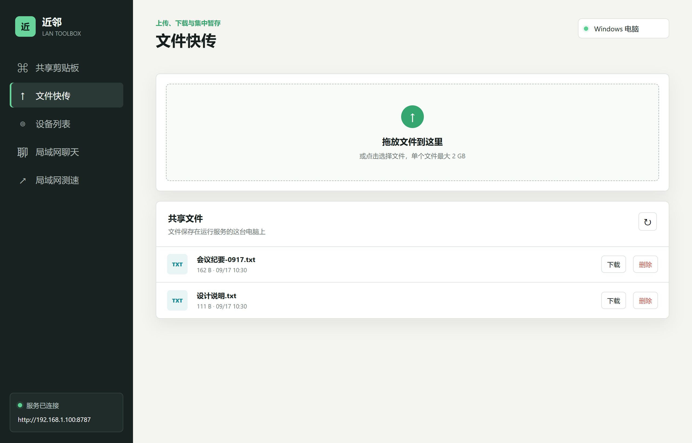
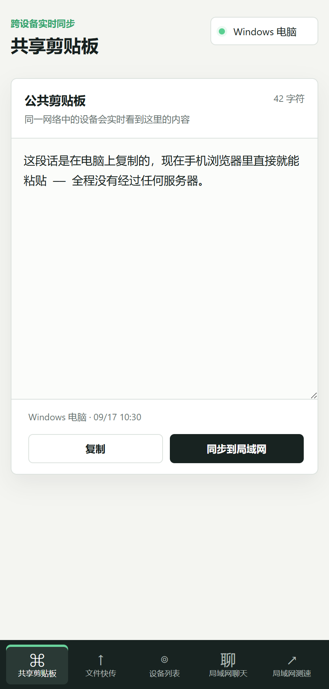
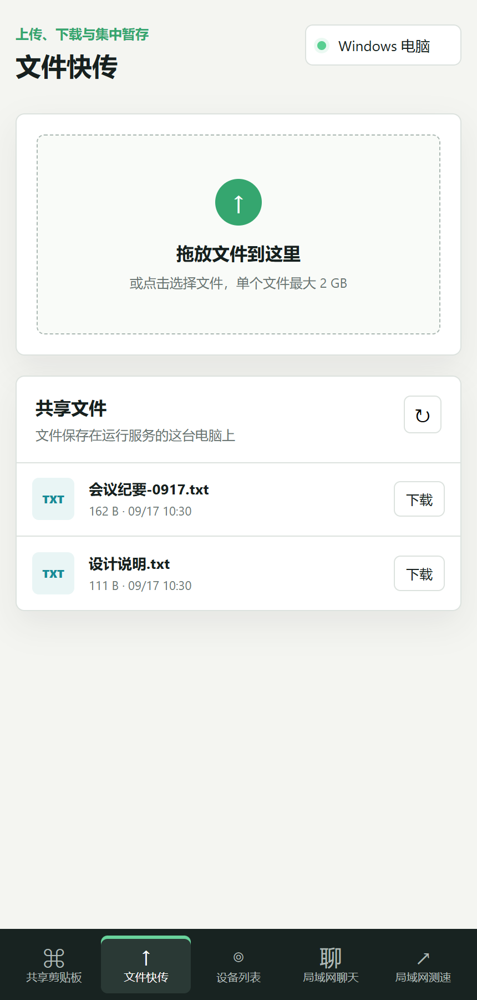

# 近邻 · 局域网工具箱

[](LICENSE)
[](https://github.com/TuTuBug/NearbyLanToolbox/releases)
[](https://github.com/TuTuBug/NearbyLanToolbox/releases)


**同一 Wi-Fi 下，手机扫个码就能和电脑互传文件。接收端不用装任何 App。**

服务端在本机 `8787` 端口起一个 HTTP 服务，同一 Wi-Fi 下的手机、平板、电脑用浏览器打开
局域网地址（或直接扫二维码），即可**互传文件**、**共享剪贴板**、**群聊**、**测速**，
并查看**局域网设备列表**。

主机端有两种运行方式，**功能完全一致**：

| 运行方式 | 平台 | 特点 |
|---|---|---|
| **单文件 exe**（推荐） | Windows 10 / 11 | 约 1.5 MB，双击即用，无需 Node.js，界面用 WebView2 承载，不弹控制台黑框 |
| **Node.js 版** | macOS / Linux / Windows | 需要 Node.js 18+，一行命令启动，macOS 可双击 `start-mac.command` |

两侧共用同一套 HTTP 接口与同一份前端页面。**任何设备都能当"客户端"** —— 手机、平板、
另一台电脑，用浏览器打开地址即可，不需要安装任何东西。
**所有数据只在局域网内流动，不经过任何服务器。**



## 为什么用它

| | 近邻 | LocalSend | Snapdrop 类网页 | 微信文件传输助手 |
|---|---|---|---|---|
| 接收端要装 App | ❌ 扫码用浏览器 | ✅ 要装 | ❌ 开网页 | ✅ 要装 |
| 需要外网 | ❌ 纯局域网 | ⚠️ 同 Wi-Fi 即可 | ✅ 需要 | ✅ 需要 |
| 文件经过服务器 | ❌ | ❌ | ✅ 有中转 | ✅ 腾讯服务器 |
| 剪贴板同步 | ✅ | ❌ | ❌ | ⚠️ 手动转发 |
| 聊天 / 测速 / 设备发现 | ✅ | ❌ | ❌ | ❌ |
| 跨平台 | ✅ 三种系统都能做主机 | ✅ 全平台 | ✅ | ✅ |
| 部署成本 | 双击一个 exe / 一行 node 命令 | 每台设备装一次 | 开网页 | 装微信 |

适合：**家里或办公室有电脑和手机，想快速在两者之间搬文件，又不想为这个装东西。**

<p align="center">
  
  &nbsp;&nbsp;
  
</p>

<p align="center"><sub>手机端：浏览器打开局域网地址（或扫码）即可使用，无需安装任何 App</sub></p>

## 下载

不想自己编译的话，直接拿现成的：

| 平台 | 下载 | 拿到之后 |
|---|---|---|
| **Windows 10 / 11** | **[⬇ NearbyLanToolbox.exe](https://github.com/TuTuBug/NearbyLanToolbox/releases/latest/download/NearbyLanToolbox.exe)** | 单文件绿色版，约 1.5 MB，**双击即用**，无需安装 |
| **macOS** | **[⬇ NearbyLanToolbox-mac.zip](https://github.com/TuTuBug/NearbyLanToolbox/releases/latest/download/NearbyLanToolbox-mac.zip)** | 解压后**双击 `start-mac.command`**，浏览器自动打开工具箱 |
| **Linux** | **[⬇ NearbyLanToolbox-linux.tar.gz](https://github.com/TuTuBug/NearbyLanToolbox/releases/latest/download/NearbyLanToolbox-linux.tar.gz)** | 解压后执行 `./start-linux.sh` |

下载页：[Releases](https://github.com/TuTuBug/NearbyLanToolbox/releases)。

macOS / Linux 包唯一的前置条件是 **Node.js 18 或更高**（一次性安装），包本身**零第三方依赖，
不需要 `npm install`**。连 Node 都没装也没关系：`start-mac.command` 会检测到并自动打开
Node.js 官网下载页，装好后回到窗口按一下回车，就继续启动。

> 为什么 Mac 上没有像 exe 那样的单文件？
> macOS 原生的可执行文件必须在 macOS 上编译并做代码签名，Windows 上无法生成。
> 所以跨平台侧采用「压缩包 + 一键启动脚本」，解压双击即可，实际体验差别不大。

Windows 版运行环境：

- Windows 10 1809+ / Windows 11
- .NET Framework 4.8（Win10 1903+ 与 Win11 已内置）
- WebView2 Runtime（Win11 及多数 Win10 已内置；若启动提示缺失，装一次
  [Microsoft Edge WebView2 Runtime](https://developer.microsoft.com/microsoft-edge/webview2/) 即可）

> 想自己编译？见下方[构建](#从源码构建)。

## 功能

- 共享剪贴板（SSE 实时同步，并带心跳轮询回退）
- 文件快传（拖拽上传、下载、删除，不限单文件大小，仅受接收盘剩余空间约束）
- 设备列表（工具箱在线客户端 + 系统 ARP 缓存）
- 局域网聊天室（SSE 实时消息，保留本次运行最近 200 条）
- 局域网测速（延迟、上传、下载）
- 连接二维码与可选访问密码
- 跨平台：macOS / Linux 用 Node.js 版，接口与功能一致
- Windows 系统托盘模式（仅 exe 版）

## 使用

### Windows exe 版

直接双击 `NearbyLanToolbox.exe`。窗口上方可以：

- 查看服务状态、在线设备数量和局域网地址
- 复制同一 Wi-Fi 设备使用的访问地址
- 显示连接二维码，并选择开启或关闭访问密码
- 打开接收文件目录 / 更改接收文件目录
- 刷新内嵌页面
- 停止或重新启动局域网服务
- 最小化或最大化软件
- 点击关闭按钮隐藏到系统托盘；在托盘菜单选择"退出"可完全关闭软件

窗口隐藏后可双击系统托盘图标恢复；右键托盘图标可复制地址、打开目录或退出。
窗口异常不可见时，可以运行 `stop.bat`。

### 扫码连接与访问密码

点击软件顶部的"连接二维码"，手机或其他电脑可直接扫描二维码打开局域网地址。

- 访问密码默认关闭，扫码后可直接使用。
- 可勾选"启用访问密码"，设置 4 到 8 位数字，也可以点击"随机生成"。
- 启用后，远程设备需要先输入密码，才能使用剪贴板、文件、聊天室、设备列表和测速。
- 二维码只包含局域网地址，不会把访问密码写进二维码。
- 本机软件窗口通过回环地址访问，不需要输入密码。

> **Node 版同理，只是没有二维码按钮**：把启动时打印的局域网地址
> （形如 `http://192.168.1.5:8787`）发给对方即可；访问密码用
> `node server.js --set-password 1234` 设置，命令行选项见
> [在 macOS / Linux 上运行](#在-macos--linux-上运行)。

访问设置保存在：

```text
%LOCALAPPDATA%\NearbyLanToolbox\access-settings.txt
```

### 接收文件目录

首次运行默认保存到 `C:\Users\当前用户名\Downloads\data\uploads`。
点击"打开目录"可直接查看文件；点击"更改目录"可选择其他文件夹，路径会记住。

```text
%LOCALAPPDATA%\NearbyLanToolbox\upload-path.txt
```

## 在 macOS / Linux 上运行

macOS 与 Linux 使用 Node.js 版后端，**接口与 exe 版完全一致**（文件互传、剪贴板、聊天室、
设备发现、测速、访问密码都有），前端也是同一份页面。

### 快速开始（直接下载版，推荐）

1. 从 [Releases](https://github.com/TuTuBug/NearbyLanToolbox/releases/latest) 下载对应压缩包
   （macOS 用 `NearbyLanToolbox-mac.zip`，Linux 用 `NearbyLanToolbox-linux.tar.gz`）
2. 解压出一个 `NearbyLanToolbox` 文件夹
3. **双击 `start-mac.command`**（Linux 执行 `./start-linux.sh`）

脚本会自动完成这一串事：

```
检查 Node.js ──没装──► 打开 nodejs.org 下载页 ──► 等你装完，按回车继续
     │装了
     ▼
检查端口是否被占用 ──被占用──► 自动往后找 8788 / 8789…
     ▼
启动服务 ──► 等服务就绪 ──► 自动用默认浏览器打开工具箱
```

首次双击若提示「无法打开，因为来自身份不明的开发者」，在文件上
**右键 → 打开 → 再点一次「打开」**即可，只需一次。

压缩包里的 `使用说明-必读.txt` 写好了给普通用户的图文步骤（含手机怎么连、
防火墙怎么放行、怎么后台常驻），可以直接转给同事。

### 从源码运行

```bash
git clone https://github.com/TuTuBug/NearbyLanToolbox.git
cd NearbyLanToolbox
./start-mac.command      # macOS
./start-linux.sh         # Linux
node server.js           # 或直接跑后端
```

需要 **Node.js 18 或更高**：

- macOS：`brew install node`，或到 [nodejs.org](https://nodejs.org) 下载安装包
- Linux：`sudo apt install nodejs` / `sudo dnf install nodejs`，或同样用 nvm 安装

**零第三方依赖，不需要 `npm install`。**

> 启动脚本在双击场景下会额外补上 `/usr/local/bin`、`/opt/homebrew/bin` 等路径，
> 避免出现「终端里能跑、双击却说找不到 node」的情况。

### 命令行选项

| 选项 | 说明 |
|---|---|
| `--port <端口>` | 服务端口，默认 `8787` |
| `--upload-dir <路径>` | 接收目录，默认项目内 `data/uploads` |
| `--set-password <密码>` | 设置访问密码（4 到 8 位数字），完成后退出 |
| `--disable-password` | 关闭访问密码，完成后退出 |
| `--show-config` | 打印当前配置（平台、设置目录、接收目录、端口、密码状态） |
| `--help` | 查看帮助 |

```bash
node server.js --set-password 1234    # 启用访问密码
node server.js                        # 启动服务（密码已生效）
node server.js --show-config          # 查看当前配置
node server.js --disable-password     # 关闭访问密码
node server.js --port 8888            # 换个端口
```

也可以直接用环境变量 `PORT`、`UPLOAD_DIR` 覆盖端口与接收目录。

### 配置文件位置

设置目录按各系统的标准位置，与 exe 版**同名同格式**，两个平台的配置互不干扰：

| 平台 | 设置目录 |
|---|---|
| macOS | `~/Library/Application Support/NearbyLanToolbox` |
| Linux | `$XDG_CONFIG_HOME/NearbyLanToolbox`（未设则 `~/.config/NearbyLanToolbox`） |
| Windows | `%LOCALAPPDATA%\NearbyLanToolbox` |

目录下两个文件：

- `access-settings.txt` —— 访问密码。第一行 `1` 表示启用、`0` 表示关闭，第二行是密码。
- `upload-path.txt` —— 接收目录（可选，不写则用项目内 `data/uploads`）。

### 首次运行的两个提示

- **macOS 会弹窗询问「是否允许 `node` 接受传入的网络连接」，请选"允许"**，
  否则手机等设备连不上。误点拒绝的话，到
  「系统设置 → 网络 → 防火墙 → 选项」把 `node` 改为允许传入连接。
- 服务窗口需要保持开启，**Control + C** 停止。

## 从源码构建

### 环境要求

| 依赖 | 说明 |
|---|---|
| Windows | 10 / 11 |
| Visual Studio 2022 及以上，或 Visual Studio Build Tools | 勾选「.NET 桌面生成工具」工作负载即可，无需完整 IDE |
| PowerShell 5.1 | 系统自带 |
| 网络 | 首次构建需联网下载依赖（可用代理） |

> 目标框架为 **.NET Framework 4.8**。如果没装「.NET Framework 4.8 Developer Pack」，
> 构建脚本会自动下载官方参考程序集补齐，**不需要管理员权限安装任何东西**。

### 构建步骤

```powershell
git clone https://github.com/TuTuBug/NearbyLanToolbox.git
cd NearbyLanToolbox

# 一条命令搞定：还原依赖 -> 编译
powershell -ExecutionPolicy Bypass -File build.ps1
```

代理环境下直连 NuGet 失败时：

```powershell
powershell -ExecutionPolicy Bypass -File build.ps1 -Proxy "http://127.0.0.1:7897"
```

产物：

```text
outputs\NearbyLanToolbox.exe
```

### 前端资源是内嵌进 exe 的

页面不走磁盘文件，而是把 `public\` 下的资源 GZip 压缩 + Base64 后
写进 `native\EmbeddedAssets.g.cs`，编译时进 exe。

`build.ps1` 每次构建都会自动重新生成它，正常不用管。
只有绕开 `build.ps1` 直接用 MSBuild 编译时，才需要先手动执行：

```powershell
powershell -ExecutionPolicy Bypass -File tools\embed-assets.ps1
```

### 源码文件必须带 UTF-8 BOM（改代码前请先看这段）

`native\*.cs` 和 `*.csproj` 里都有中文，这些文件**必须是带 BOM 的 UTF-8**。

原因：csc 读取**无 BOM** 的源文件时，会按**当前系统的 ANSI 代码页**解码，而不是 UTF-8：

| 构建机器 | 默认代码页 | 结果 |
|---|---|---|
| 中文 Windows | CP936（GBK） | UTF-8 中文字节被解成别的字，**编译能过**，只是中文变乱码 |
| 英文 / 其他区域设置（含 GitHub Actions runner） | CP1252 | UTF-8 中文字节里存在 CP1252 未定义的字节，解码失败 → **编译中断** |

典型的「本机编得过、CI 编不过」陷阱，而且报错位置在编译器内部，很难联想到编码。

工程里已经做了三重防护，新增文件时请注意：

1. `native\*.cs`、`*.csproj` 均已带 BOM
2. `csproj` 里设置了 `<CodePage>65001</CodePage>`
3. `tools\embed-assets.ps1` 生成 `EmbeddedAssets.g.cs` 时写的是**带 BOM** 的 UTF-8

如果你新增 C# 源文件并写了中文，记得存成「UTF-8 with BOM」（VS Code 右下角编码处选
`UTF-8 with BOM` 保存）。

### 单独还原依赖

```powershell
powershell -ExecutionPolicy Bypass -File tools\fetch-deps.ps1
```

会把以下内容下载到 `deps\`（已在 `.gitignore` 中忽略）：

- `Microsoft.Web.WebView2` 1.0.2535.41 的托管程序集与 x64/x86 原生加载器
- `ZXing.Net` 0.16.10
- .NET Framework 4.8 参考程序集（**始终下载**，不看本机是否装了 Developer Pack ——
  这样任意机器上的构建输入完全一致）

## 项目结构

```text
NearbyLanToolbox/
├── build.ps1                     一键构建 Windows exe（还原依赖 + 内嵌前端 + 编译）
├── start.bat / stop.bat          Windows 启动 / 停止（停止按端口 8787 结束进程）
├── start-mac.command             macOS 双击启动（检查 Node / 端口，自动开浏览器）
├── start-linux.sh                Linux 启动脚本（同上，终端执行）
├── 使用说明-必读.txt              面向普通用户的说明，随跨平台发布包一起分发
├── server.js                     Node.js 版后端入口（跨平台：macOS / Linux / Windows）
├── lib/
│   ├── access.js                 访问密码与授权判定（与 exe 版共用设置文件格式）
│   └── arp.js                    邻居表解析（Windows / macOS / Linux 三种输出格式）
├── public/                       前端源码（两个后端共用；改这里 build.ps1 会自动重新内嵌）
│   ├── index.html
│   ├── app.js
│   └── styles.css
├── native/                       Windows exe 版（C# / .NET Framework 4.8 / WinForms）
│   ├── NearbyLanToolbox.csproj   构建工程
│   ├── Server.cs                 内嵌 HTTP 服务 + 程序入口（Program.Main）
│   ├── MainForm.cs               WinForms 主窗体、托盘、二维码弹窗
│   ├── WebViewRuntime.cs         内嵌依赖加载（AssemblyResolve）与原生加载器释放
│   ├── EmbeddedAssets.g.cs       自动生成：内嵌的页面/脚本/样式（勿手工编辑）
│   └── app.ico                   程序图标
├── tools/
│   ├── fetch-deps.ps1            还原 Windows 构建依赖到 deps\
│   ├── embed-assets.ps1          重新生成 EmbeddedAssets.g.cs（build.ps1 已自动调用）
│   ├── verify-embedded-assets.js 校验内嵌资源与 public\ 是否一致（CI 上独立把关）
│   ├── pack-release.py           打包 macOS / Linux 发布包到 outputs/
│   ├── test-arp-parser.js        邻居表解析测试（含 macOS / Linux 真实样本）
│   └── test-access.js            访问密码与授权判定测试
├── .github/workflows/release.yml 推送 main 即构建；推送 tag 额外发版到 Releases
├── start-mac.command             macOS 一键启动（自动补 PATH、找 Node、选端口）
├── start-linux.sh                Linux 一键启动
├── 使用说明-必读.txt              给普通用户的解压/放行/连接说明
├── docs/screenshots/             界面截图
├── package.json
└── deps/                         Windows 构建时生成，不入库
```

### 打发布包

```bash
python tools/pack-release.py          # 同时产出 mac zip 与 linux tar.gz
python tools/pack-release.py mac      # 只打 macOS 包
```

产物在 `outputs/`。打包脚本只收运行时必需文件，并**显式写入 Unix 可执行权限位**——
这一步很关键：缺了它，macOS 解压后 `start-mac.command` 没有可执行权限，双击直接报错。

推送 `v*` 形式的 tag 会触发 GitHub Actions，自动构建 exe + mac zip + linux tar.gz
并创建 Release，三个平台一次发齐：

```bash
git tag v1.0 && git push origin v1.0
```

> **不要删除后重建同一个 tag**：已发布的 Release 会跟着 tag 一起消失（本项目踩过这个坑）。
> 要重新发版就推一个新 tag；推 `main` 只构建、不发版，适合反复验证构建链路。
>
> **另一个坑：`gh release create <tag>` 在 tag 不存在时会自动创建一个标签，并指向默认分支
> 的当前 HEAD。** 如果发版 job 拿到的 tag 名有误（例如引用了不存在的旧标签），就会凭空
> 多出一个「指向最新代码、但版本号是旧的」标签和 Release —— 内容是对的，名字是错的。
> 发版后请务必用 `git ls-remote --tags origin` 核对标签，并访问
> `/releases/tag/<你的版本>` 确认页面存在。
>
> 构建日志（含依赖布局、内嵌资源校验、MSBuild 输出）会推到 `ci-logs` 分支的
> `build.log`，用 raw 地址即可查看，不需要登录 GitHub。`ci-logs/README.md` 里记着
> 最近一次构建的 `ref` 与 `sha`，是排查「这次到底被哪个 ref 触发」最快的入口。

> **关于两个后端**：`native/` 是 Windows 单文件 exe 版（C# / WinForms），`server.js` 是跨平台
> Node.js 版。两者提供**同一套 HTTP 接口**、共用 `public/` 下的同一份前端，行为保持一致，
> 区别只在运行方式 —— exe 版带原生窗口与系统托盘，Node 版是命令行程序、界面用浏览器打开。
>
> 跑一遍测试可以验证跨平台解析与授权逻辑：
>
> ```bash
> npm test        # 等价于 node tools/test-arp-parser.js && node tools/test-access.js
> ```

## 单文件是怎么做出来的

理解这一点，改构建配置时才不会踩坑：

1. `tools\fetch-deps.ps1` 把 WebView2、ZXing 等程序集还原到 `deps\`。
2. `native\NearbyLanToolbox.csproj` 里把它们声明为 `<EmbeddedResource>`，
   并用 `LogicalName` 指定资源名，例如 `NearbyLanToolbox.zxing.dll`。
   这些程序集以 `Private=false` 参与编译，**不复制到输出目录**。
3. 程序启动时 `WebViewRuntime.Initialize()` 注册 `AppDomain.AssemblyResolve`，
   在运行期按需从资源流 `Assembly.Load` 加载这些依赖。
4. `WebView2Loader.dll`（原生 DLL，不能 `Assembly.Load`）会被释放到
   `%LOCALAPPDATA%\NearbyLanToolbox\runtime\1.0.2535.41\{x64,x86}\` 再 `SetDllDirectory`。

因此 **`WebViewRuntime.cs` 中硬编码的资源名与 csproj 里的 `LogicalName` 必须严格一致**，
改名字会直接导致程序启动时报「缺少内嵌组件」。

## 常见问题

**构建报 MSB3644「找不到 .NETFramework,Version=v4.8 的引用程序集」**
依赖没还原完整。执行 `tools\fetch-deps.ps1`（或直接跑 `build.ps1` 不加 `-SkipDeps`）。

**构建报找不到 `HttpUtility` / `JavaScriptSerializer`**
工程必须引用 `System.Web`（`HttpUtility`）与 `System.Web.Extensions`（`JavaScriptSerializer`），
这两个不能省。

**构建成功但 exe 打不开内嵌组件**
检查 `WebViewRuntime.cs` 里的资源名字符串与 csproj 的 `LogicalName` 是否逐字一致。

**端口 8787 被占用**
exe 版运行 `stop.bat`；Node 版换个端口：`node server.js --port 8888`。
或用 `netstat -ano | findstr 8787`（macOS / Linux：`lsof -i :8787`）找到 PID 后手动结束。

**macOS 上手机连不上**
第一次启动时 macOS 会询问「是否允许 `node` 接受传入的网络连接」，选**允许**。
若误点拒绝，到「系统设置 → 网络 → 防火墙 → 选项」把 `node` 改为允许传入连接。

**Mac 上设备列表为空**
设备列表读的是本机 ARP 缓存（近期通信过的设备），刚开机或没和其他设备通信过时会是空的。
先从手机访问一次工具箱，再去点「重新扫描」。

## 系统要求与注意事项

- 支持 32 位和 64 位 Windows，需要 Microsoft Edge WebView2 Runtime。
  Windows 11 和大多数仍在更新的 Windows 10 通常已经自带。
- macOS / Linux 走 Node.js 版，需要 Node.js 18 或更高；Windows 两种方式都能用。
- macOS 首次运行需在系统弹窗中允许 `node` 接受传入连接，否则其他设备连不上。
- Windows 首次运行时，防火墙可能询问是否允许访问，请仅勾选"专用网络"。
- EXE 当前未做数字签名；SmartScreen 提示未知发布者时，请确认文件来源后再运行。
- 未启用访问密码时，所有打开地址的局域网设备都能操作共享内容，请只在可信网络中运行。
- ARP 列表是本机近期通信缓存，不等于路由器的完整在线设备列表。
- 访客 Wi-Fi、校园网或开启 AP 隔离的网络可能阻止设备互访。

## 许可

[MIT](LICENSE)
